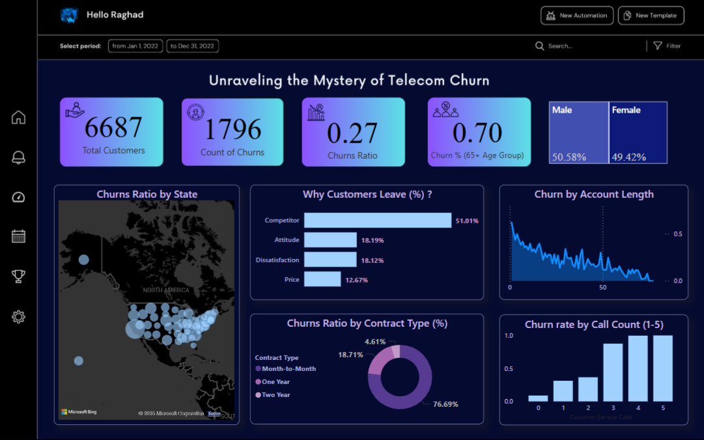

# 📲💻 Telecom Churn Dashboard  

**Unraveling the Mystery of Telecom Churn✨**  

This interactive dashboard visualizes customer churn insights, helping identify key reasons for churn, demographic trends, and contract-based patterns.  

## 🌌 Key Features  
- **Customer Metrics**: Total customers, churn count, and churn ratio  
- **Churn Reasons**: Competitor influence, dissatisfaction, pricing impact  
- **Contract Analysis**: Churn rate by contract type (month-to-month, yearly, etc.)  
- **Geospatial Insights**: Churn distribution across states  
- **Call & Account Analysis**: Churn rate based on customer service calls and account length  

## 📌 Tech Stack  
- **Power BI**  
- **Data Source**: Fake datasets 

## 📷 Main Dashoard 
  

## 📥 Installation  
1. Open the dashboard file in Power BI workbook.  

